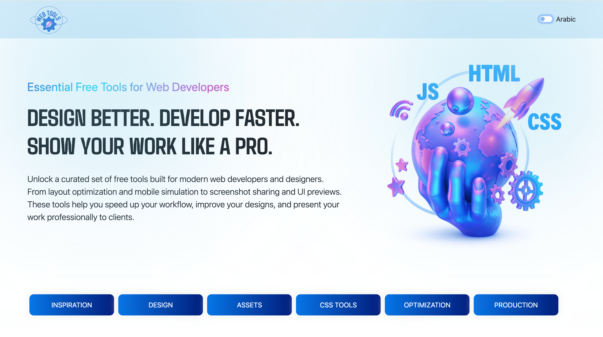
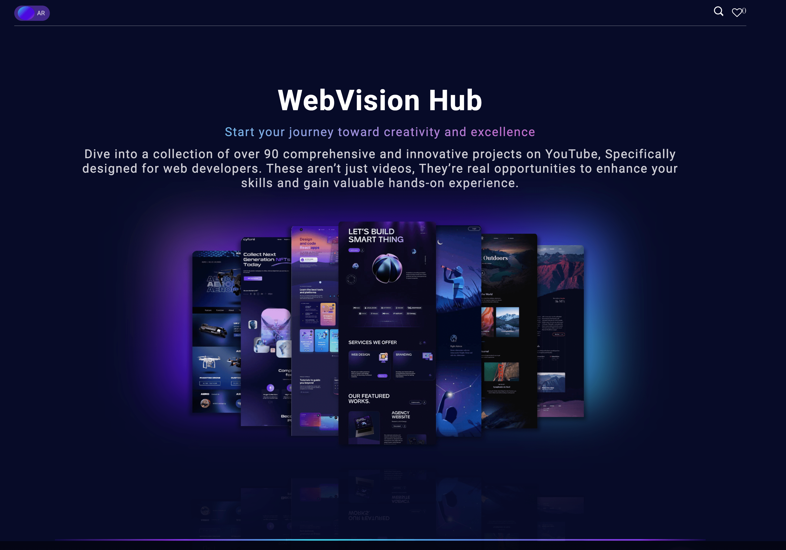
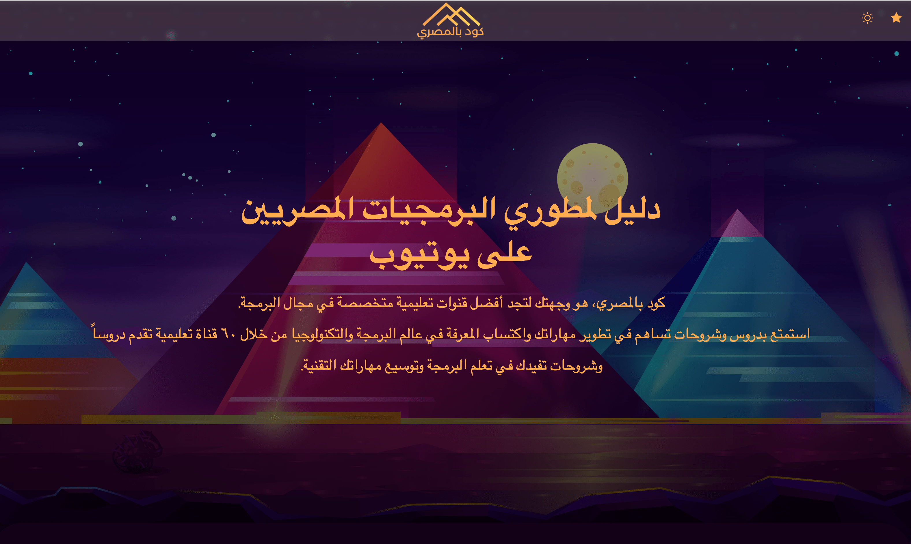
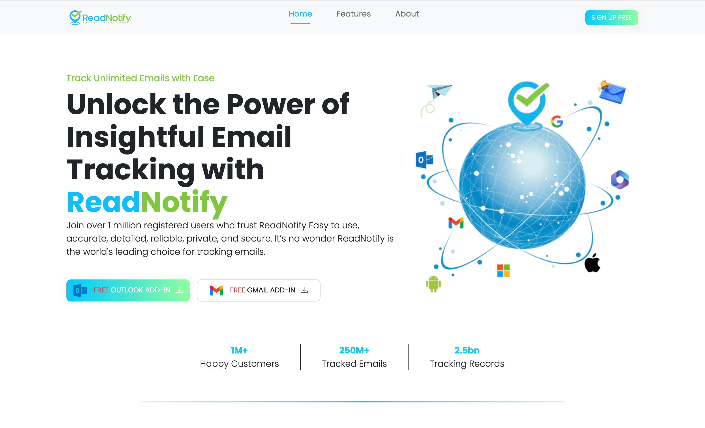
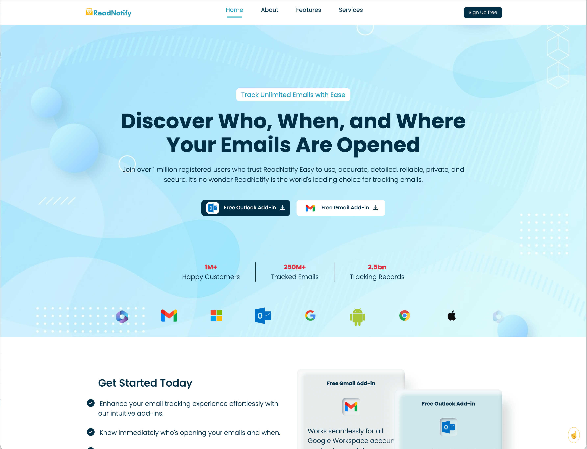
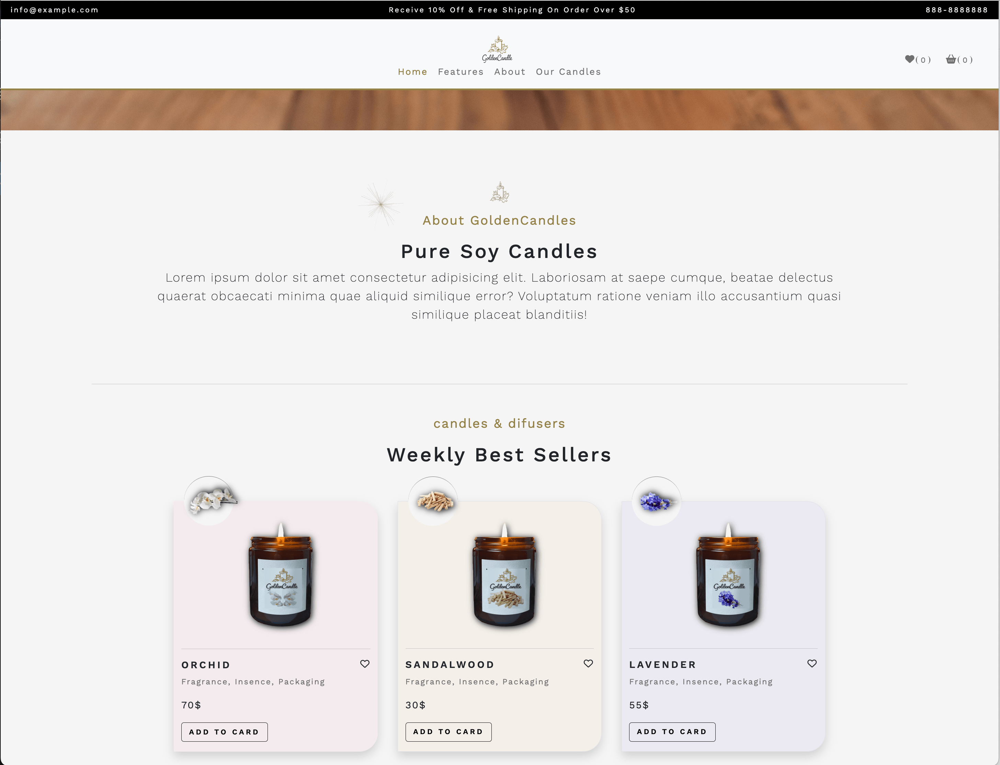

# 👋 Hi, I'm Walaa Ayyad

I'm a front-end developer passionate about building clean, responsive, and user-friendly web applications. I love discovering and curating tools that improve developer workflows and creativity.

---

## 🔧 My Latest Project

### 🌐 [Web Developer Tools](https://walaaayyad.github.io/webDeveloperTools/)

A curated collection of **free tools for web developers**, including:

- Inspiration websites
- Free images, icons, and fonts
- CSS utilities and generators
- Performance and optimization tools
- Page speed testers

Built with **React**, **Vite**, **React-Bootstrap**, **AOS animation**, and supports **Arabic (RTL)** using `react-i18next`.

## 📸 My Top Projects

<table>
  <tr>
    <td>
      
    </td>
    <td>
      
    </td>
    <td>
      
    </td>
  </tr>
  <tr>
    <td>
      
    </td>
    <td>
      
    </td>
    <td>
      
    </td>
  </tr>
</table>

---

## 💡 A Bit About Me

- 🔭 I’m currently working on adding more tools and categories to my developer tools project
- 🌱 I’m currently learning more about React.js
- 👯 I’m looking to collaborate on open-source projects focused on web performance or UI/UX
- 💬 Ask me about front-end development, multilingual websites, or UI design tools
- 📫 How to reach me: `walaa_ayyad7@yahoo.com` 
- ⚡ Fun fact: I love organizing resources and creating developer toolkits

---

